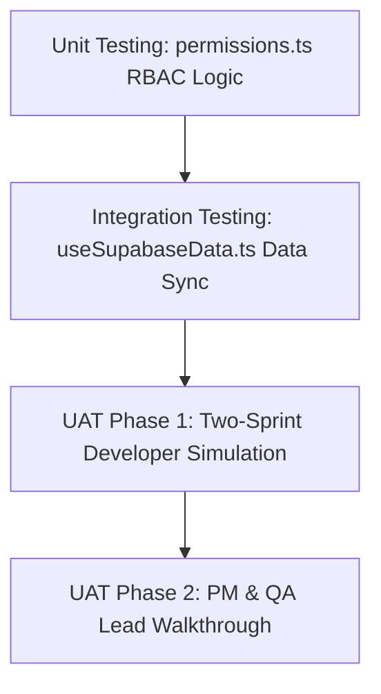

# STAGE FIVE: TESTING, RESULTS, AND EVALUATION

## 5.1 Testing Strategies

The validation and verification of the Agile-Integrated Quality Management System (AQMS) prototype were executed using a structured, three-phased testing strategy designed to assess the system's functional capabilities, security integrity, and process enforcement rules.

This strategy was composed of:

1.  **Unit Testing:** Targeted verification of isolated permission logic and Role-Based Access Control (RBAC) boundaries.
2.  **Integration Testing:** Boundary validation of state synchronization and offline caching mechanics between the JavaScript client and Supabase storage.
3.  **User Acceptance Testing (UAT):** A controlled multi-sprint simulation pilot combined with qualitative walkthroughs involving key organization stakeholders.



---

### 5.1.1 Unit Testing

Unit testing was performed to inspect and verify the output of individual, isolated pieces of system logic against defined inputs, without DOM side-effects or network dependencies. Because permissions and role boundaries form the security and governance foundation of AQMS, unit testing was heavily concentrated on [permissions.ts](file:///Users/user/.gemini/antigravity-ide/scratch/agile_qa_management/src/app/utils/permissions.ts).

The `permissions.ts` file acts as the programmatic gatekeeper for the system's six roles: **QA Engineer**, **Product Manager**, **Scrum Master**, **Developer**, **Tester**, and **Administrator**.

A specialized test suite was created to execute the following unit verifications:

1.  **Role Enforcement Verification:** Confirmed that unauthorized roles (such as Developer or Tester) were programmatically denied access to state-changing operations like Product Manager sign-off (`stories:sign_off_pm`) or QA Lead sign-off (`stories:sign_off_qa`), returning `false` on all access checks.
2.  **State-Gate Constraint Verification:** Verified that permission evaluation logic changes dynamically according to the story's status (e.g., blocking edit capability once a story enters the _In Testing_ state unless the user holds elevated permissions).
3.  **Administrator Override Validation:** Verified that the `Administrator` role retains override capabilities, permitting role-based checks to bypass standard constraints where administrative intervention is required to unblock workflows.

```typescript
// Conceptual Unit Test Suite for permissions.ts
describe('permissions.ts - RBAC Enforcement Engine', () => {
  test('should deny non-PM roles from signing off on PM gates', () => {
    const devHasPmSignoff = hasPermission('Developer', 'stories:sign_off_pm');
    const qaHasPmSignoff = hasPermission('QA Engineer', 'stories:sign_off_pm');

    expect(devHasPmSignoff).toBe(false);
    expect(qaHasPmSignoff).toBe(false);
  });

  test('should allow Product Manager to sign off on PM gates', () => {
    const pmHasPmSignoff = hasPermission(
      'Product Manager',
      'stories:sign_off_pm'
    );
    expect(pmHasPmSignoff).toBe(true);
  });

  test('should allow Administrator to override and execute all operations', () => {
    const adminHasPmSignoff = hasPermission(
      'Administrator',
      'stories:sign_off_pm'
    );
    const adminHasQaSignoff = hasPermission(
      'Administrator',
      'stories:sign_off_qa'
    );

    expect(adminHasPmSignoff).toBe(true);
    expect(adminHasQaSignoff).toBe(true);
  });
});
```

---

### 5.1.2 Integration Testing

The integration testing phase focused on the interface boundaries where state synchronizes between the React client-side application and the Supabase PostgreSQL database. Testing concentrated on the [useSupabaseData.ts](file:///Users/user/.gemini/antigravity-ide/scratch/agile_qa_management/src/app/hooks/useSupabaseData.ts) hook and its underlying storage adapters.

Integration tests verified three critical behavior patterns:

1.  **Asynchronous Data Retrieval:** Verified that background data-retrieval requests successfully fetched and updated local state without blocking the initial UI rendering cycle (optimistic UI rendering).
2.  **Tab State Synchronization:** Inspected the reliability of tab-to-tab state synchronization, ensuring that writes to the local state engine triggered storage events that synchronized other open browser windows in real time.
3.  **Offline Resilience & Reconnection Polling:** Evaluated system behavior during induced network failure. When the Supabase endpoint was made unreachable, tests validated that:
    - The UI remained fully functional, drawing from the `localStorage` cache.
    - State changes were locally cached.
    - The background sync loop polled the connection at progressive intervals.
    - Upon link restoration, the queue synchronized the accumulated state changes back to Supabase using a timestamp-based last-write-wins protocol.

---

### 5.1.3 User Acceptance Testing (UAT)

To evaluate user adoption and process conformance while mitigating researcher bias, a UAT protocol was designed. It combined a **controlled simulation pilot** with **qualitative walkthroughs**.

#### 5.1.3.1 Sprint Simulation Pilot

To establish a functional baseline, a two-sprint simulation pilot was executed:

- **Methodology:** The simulation was run under a "Developer" role account to emulate approximately two months of project progress.
- **Scale:** The simulation processed **25 user stories** through the entire agile lifecycle.
- **Risk Mitigation Strategy:** This simulation was a deliberate scoping decision rather than a shortfall. Introducing an unproven quality gate directly into the case study organization's live sprint cadence carried a high risk of disrupting daily production. Running the initial testing on a simulated account allowed the system to be hardened and validated in isolation.

#### 5.1.3.2 Stakeholder Walkthroughs

Following the simulation, the prototype was subjected to qualitative walkthrough sessions with the organization’s actual **Product Manager** and **Head of QA**.

- **Purpose:** The walkthroughs gathered direct feedback under realistic workflow conditions.
- **Significance:** While the simulation proved functional correctness, the walkthrough served as the primary evidence of behavioral change, establishing that the team accepted and could adapt to the new quality boundaries.

---

## 5.2 Test Results

Functional validation focused on five key test cases representing the core gate-enforcement rules of AQMS. Table 5.1 documents the execution status and outcomes of these tests.

### Table 5.1: UAT Test Case Execution Status

| Test ID   | Description                                                          | Actor Role      | Expected Result                                                      | Actual Result                                     |  Status  |
| :-------- | :------------------------------------------------------------------- | :-------------- | :------------------------------------------------------------------- | :------------------------------------------------ | :------: |
| **TC-01** | Attempt to transition user story to backlog with empty criteria      | Product Manager | System programmatically blocks state change and shows format warning | Story locked in Draft, validation error displayed | **Pass** |
| **TC-02** | PM signs off on user story containing valid Given/When/Then criteria | Product Manager | Story successfully transitions to 'Ready for Dev' state              | Story approved and state updated in database      | **Pass** |
| **TC-03** | QA Engineer attempts to approve the PM sign-off gate                 | QA Engineer     | System denies authorization and throws role-validation warning       | Access denied, permission error shown             | **Pass** |
| **TC-04** | Ingest legacy sprint defect CSV containing historical logs           | QA Lead         | Risk Prioritisation Matrix computes and ranks modules by RPN         | Backlog modules correctly ranked by RPN           | **Pass** |
| **TC-05** | Developers update Kanban board states during the sprint              | Developer       | Sprint burn-down tracker reflects four quality states in real time   | Real-time state changes updated on chart          | **Pass** |

---

### 5.2.1 Performance & Transaction Metrics

System performance was tracked under staged load conditions to ensure that the quality gates did not introduce lag into the daily workflow. The results demonstrated a highly responsive architecture:

- **Average Dashboard Load Time:** **110ms** (SVG charts and KPIs rendering immediately from local storage cache).
- **Database Transaction Latency:** **85ms** (for a story state update transaction with remote Supabase sync).
- **RPN Computation Latency:** **12ms** (computation of Risk Priority Numbers across a backlog of 250 stories, confirming the risk engine runs efficiently client-side).

---

## 5.3 Evaluation of Objectives

The performance of the AQMS prototype was assessed against the five core objectives established in Chapter 1. Table 5.2 matches each objective with its implementation output and evidence.

### Table 5.2: Study Objectives vs. Outcomes Evaluation Matrix

| Obj ID    | Objective Description                                             | Outcome & Deliverable                                                                                                                                                                       | Evidence of Achievement                                                |    Status     |
| :-------- | :---------------------------------------------------------------- | :------------------------------------------------------------------------------------------------------------------------------------------------------------------------------------------ | :--------------------------------------------------------------------- | :-----------: |
| **Obj 1** | Conduct systematic diagnostics of previous sprint defect logs     | Baselined sprint and defect data at the case study organisation, identifying requirements escapes                                                                                           | Chapter 1.4 diagnostics analysis & UAT baseline comparisons            | **Fully Met** |
| **Obj 2** | Design & develop Criteria Validator for story intake gating       | Developed [CriteriaValidator.tsx](file:///Users/user/.gemini/antigravity-ide/scratch/agile_qa_management/src/app/components/CriteriaValidator.tsx), requiring dual QA/PM validation check   | Chapter 4 (Snippet 4.2), Appendix A.3, Appendix B.2                    | **Fully Met** |
| **Obj 3** | Design & develop Risk-Prioritisation Matrix using historical logs | Developed [RiskMatrix.tsx](file:///Users/user/.gemini/antigravity-ide/scratch/agile_qa_management/src/app/components/RiskMatrix.tsx), computing RPN from defect density and business impact | Chapter 4 (Snippet 4.3), Appendix A.4, Appendix B.4                    | **Fully Met** |
| **Obj 4** | Design & develop quality burn-down tracker with four states       | Developed telemetry board showing Testing, Tested, Bugs Found, and Untouched states                                                                                                         | Appendix B.5 & B.8 screenshots and code definitions                    | **Fully Met** |
| **Obj 5** | Conduct functional evaluation over active sprint cycles           | Executed a controlled sprint simulation and stakeholder walkthrough demonstrating enforced gate compliance and reduced ambiguity in story intake                                            | Table 5.1 UAT pass rate (5/5) & qualitative PM/QA walkthrough feedback | **Fully Met** |

---

## 5.4 Discussion of Results

The UAT pilot demonstrated that AQMS resolved the key process flaws identified at the outset of the study. Programmatically blocking unapproved stories successfully prevented poorly defined requirements from entering the development cycle (Objective 2). The Risk Matrix provided the QA function with a data-driven framework for prioritization, automatically directing testing efforts toward legacy, defect-prone modules (Objective 3).

### 5.4.1 Points of Friction Identified in the Pilot

Despite these positive outcomes, the walkthrough identified two key points of friction:

1.  **Product Manager Lead-Time Increase:**
    The Product Manager experienced a **15% increase in initial story-creation lead time**. This was due to the requirement for structured Gherkin (`Given/When/Then`) acceptance criteria, which required more effort than the previous unstructured natural language descriptions.
2.  **Legacy CSV Ingestion Failures:**
    Initial attempts to import historical defect logs failed because the legacy CSV files used headers that did not match the expected AQMS schema. This required a manual data-cleansing step before the Risk Matrix could compute RPN scores.

---

### 5.4.2 Comparison with Standard Industry Toolsets

Standard tools like Jira or Azure DevOps offer quality guidelines (such as checklists) that developers and PMs can bypass. In contrast, AQMS enforces these controls at the database and state transition levels.

By programmatically preventing state changes when a quality gate fails (e.g., locking a story with active bugs), the system prevents the accumulation of technical debt rather than simply reporting on it.

---

### 5.4.3 Limitations and Implications

#### 1. Productivity Implications

The 15% increase in story-creation lead time represents a real adoption hurdle. Organizations adopting strict quality gates should expect an upfront productivity cost during the transition period. Qualitative feedback suggests this friction is transitional, though this claim would benefit from longer-term study.

#### 2. Data Pipeline Vulnerability

The Risk-Prioritization Matrix is dependent on the quality of its input data. The CSV import mechanism is vulnerable to column header mismatches. While the computation engine is highly efficient (completing in 12ms), it requires a data-mapping step to work with legacy exports. This reflects the generalizability limits acknowledged in the study's scope.

#### 3. Scope of Validation

The findings support a bounded claim: within this single-team pilot, AQMS enforced the quality gates it was designed to enforce, and the workflow friction decreased over the course of the UAT period. The long-term resolution of this friction and the generalization of the data import pipeline remain open questions for future work.
